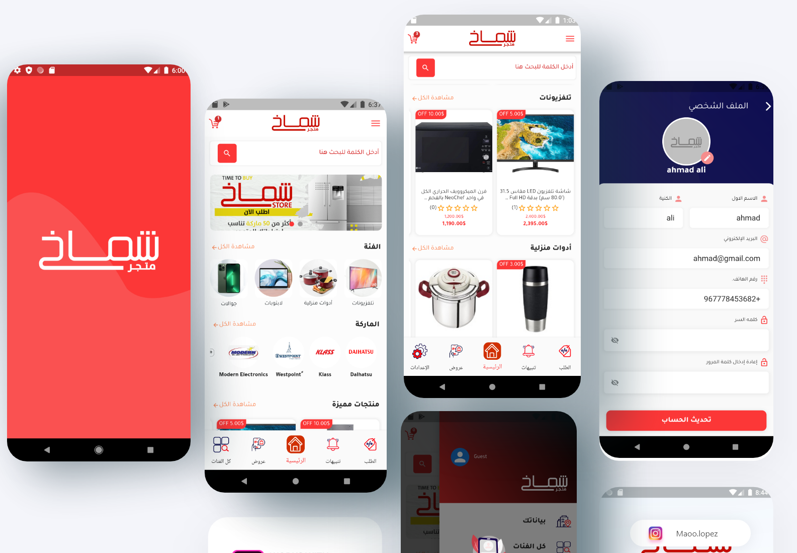
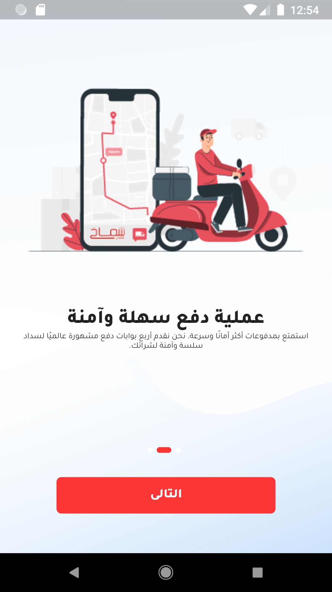

# flutter_shammak_ecommerce

A new Flutter setup application for starting a project.

## Getting Started

This project is a starting point for a Flutter application.

A few resources to get you started if this is your first Flutter project:

- [Lab: Write your first Flutter app](https://flutter.dev/docs/get-started/codelab)
- [Cookbook: Useful Flutter samples](https://flutter.dev/docs/cookbook)

For help getting started with Flutter, view our
[online documentation](https://flutter.dev/docs), which offers tutorials,
samples, guidance on mobile development, and a full API reference.

## Screenshots 📸

       
  
  
   

Description
A demo app that demonstrates Flutter's ability to create beautiful UI with complex animations. The app fetches recipes from local storage.

📦 Packages
Description	Package
shared_preferences	shared_preferences
State Management	Provider

